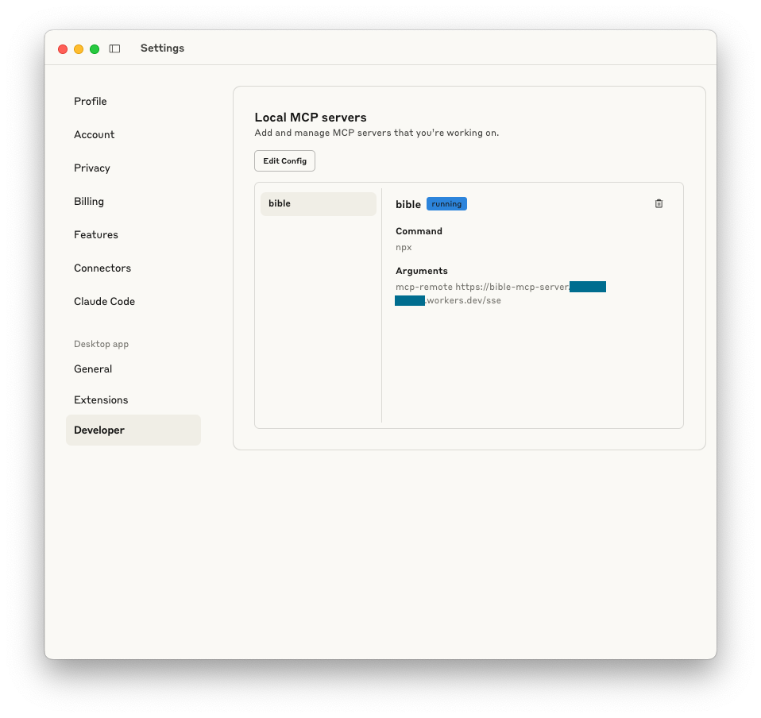
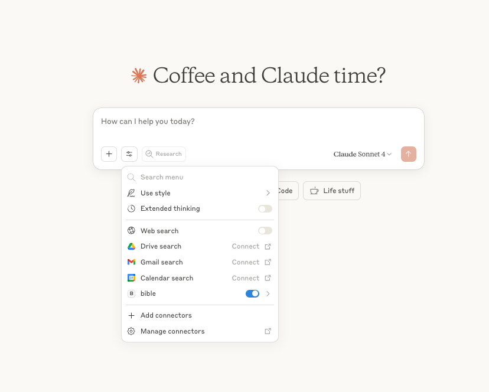
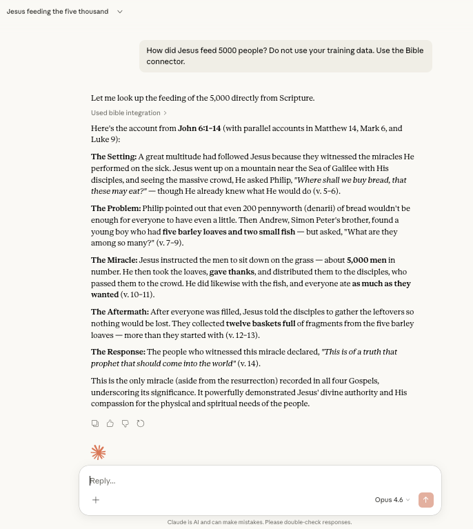
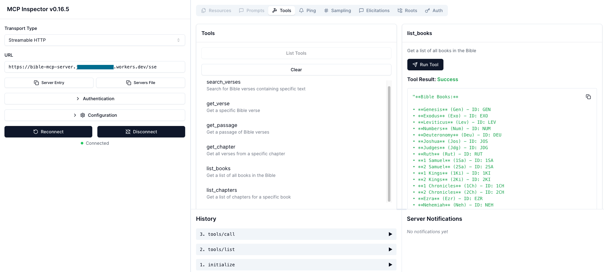

# Bible MCP Server for Cloudflare Workers

A Model Context Protocol (MCP) server that provides Bible search and verse retrieval tools, deployed on Cloudflare Workers. This server uses the Scripture API Bible service to provide access to various Bible translations.

## Quick Start

### 1. Get API Key
1. Go to [https://scripture.api.bible/](https://scripture.api.bible/)
2. Sign up for a free account
3. Get your API key from the dashboard

### 2. Deploy to Cloudflare
```bash
# Install dependencies
npm install

# Login to Cloudflare
npx wrangler login

# Set your API credentials (you'll be prompted to enter them securely)
npx wrangler secret put BIBLE_API_KEY
npx wrangler secret put BIBLE_ID
npx wrangler secret put BASE_URL

# Deploy to Cloudflare Workers
npx wrangler deploy
```

**When prompted for secrets, enter:**
- **BIBLE_API_KEY**: Your API key from scripture.api.bible
- **BIBLE_ID**: `de4e12af7f28f599-02` (King James Version)
- **BASE_URL**: `https://api.scripture.api.bible/v1`

### 3. Test Your Deployment
```bash
# Test health endpoint
curl https://your-worker-domain.workers.dev/health

# Should return: OK
```

## Available Bible Tools

Your MCP server provides two consolidated tools with multiple actions:

### 1. **bible_content** (Bible Content)

Read and search Bible verses. Use the `action` parameter to specify what to do:

| Action | Description | Required Parameters |
|--------|-------------|---------------------|
| `search` | Find verses by text | `query` |
| `verse` | Get a single verse (e.g., GEN.1.1, JHN.3.16) | `verse_id` |
| `passage` | Get a verse range (e.g., GEN.1.1-GEN.1.5) | `passage_id` |
| `chapter` | Get a full chapter | `book_id`, `chapter` |

Optional: `response_format` — `concise` (default, essential info only) or `detailed` (full text with verse numbers). Use `detailed` when the user needs verse-by-verse structure.

### 2. **bible_reference** (Bible Reference)

Navigate Bible structure:

| Action | Description | Required Parameters |
|--------|-------------|---------------------|
| `list_books` | List all Bible books with names and abbreviations | — |
| `list_chapters` | List chapters for a book | `book_id` |

Optional: `response_format` — `concise` (default) or `detailed` (includes IDs for follow-up tool calls).

## Common Bible Translations

You can use these Bible IDs:
- `de4e12af7f28f599-02` - King James Version (KJV)
- `06125adad2d5898a-01` - New International Version (NIV)
- `f72b840c855f362c-04` - English Standard Version (ESV)
- `592420522e16049f-01` - New American Standard Bible (NASB)

## For Development

```bash
# Start local development server
npm run dev

# Deploy changes
npm run deploy
```

## Troubleshooting

1. **Authentication Error**: Make sure you've run `npx wrangler login`
2. **API Key Issues**: Verify your Scripture API key is valid and set correctly
3. **Deployment Failed**: Check you have the correct permissions in Cloudflare

## Using Your MCP Server

### Claude Desktop 

Add this configuration to your Claude Desktop MCP settings:

1. Open **Claude Desktop**
2. Go to **Settings** → **Developer** → **Edit Config**
3. Add this configuration to the config file:

```json
{
  "mcpServers": {
    "bible": {
      "command": "npx",
      "args": ["mcp-remote", "https://your-worker-domain.workers.dev/sse"]
    }
  }
}
```

4. **Install mcp-remote** (first time only):
```bash
npm install -g mcp-remote
```

5. **Restart Claude Desktop**

After restarting, you'll see the Bible connector available in Claude's settings and chat menu:





You can now ask Claude to search Bible verses, get specific passages, or explore different books!

**Example prompts to try:**

- "How did Jesus feed 5,000 people?"
- "Get me Genesis 1:1"
- "What verses are in Psalm 23?"



## What's Deployed

Your Cloudflare Worker provides:

- **Health Check**: `https://your-domain.workers.dev/health`
- **MCP SSE Endpoint**: `https://your-domain.workers.dev/sse` (GET for SSE, POST for JSON-RPC)
- **Main Page**: `https://your-domain.workers.dev/` (info page)

## Troubleshooting

1. **Authentication Error**: Make sure you've run `npx wrangler login`
2. **API Key Issues**: Verify your Scripture API key is valid and set correctly
3. **Deployment Failed**: Check you have the correct permissions in Cloudflare
4. **Claude Desktop Connection Issues**: 
   - Make sure `mcp-remote` is installed globally: `npm install -g mcp-remote`
   - Restart Claude Desktop after adding the configuration
   - Check that your worker URL is correct in the config
5. **MCP Tools Not Appearing**: Verify your API credentials are set correctly using `npx wrangler secret list`

## Testing Your Server

You can test your MCP server using the MCP Inspector before connecting it to Claude Desktop:



## Helpful Resources

- [MCP Inspector](https://github.com/modelcontextprotocol/inspector) - Debug and test MCP servers
- [Cloudflare Remote MCP Guide](https://developers.cloudflare.com/agents/guides/remote-mcp-server/) - Deploy MCP on Workers
- [Anthropic Custom Connectors](https://support.anthropic.com/en/articles/11175166-getting-started-with-custom-connectors-using-remote-mcp) - Connect remote MCP to Claude Desktop

## License

MIT